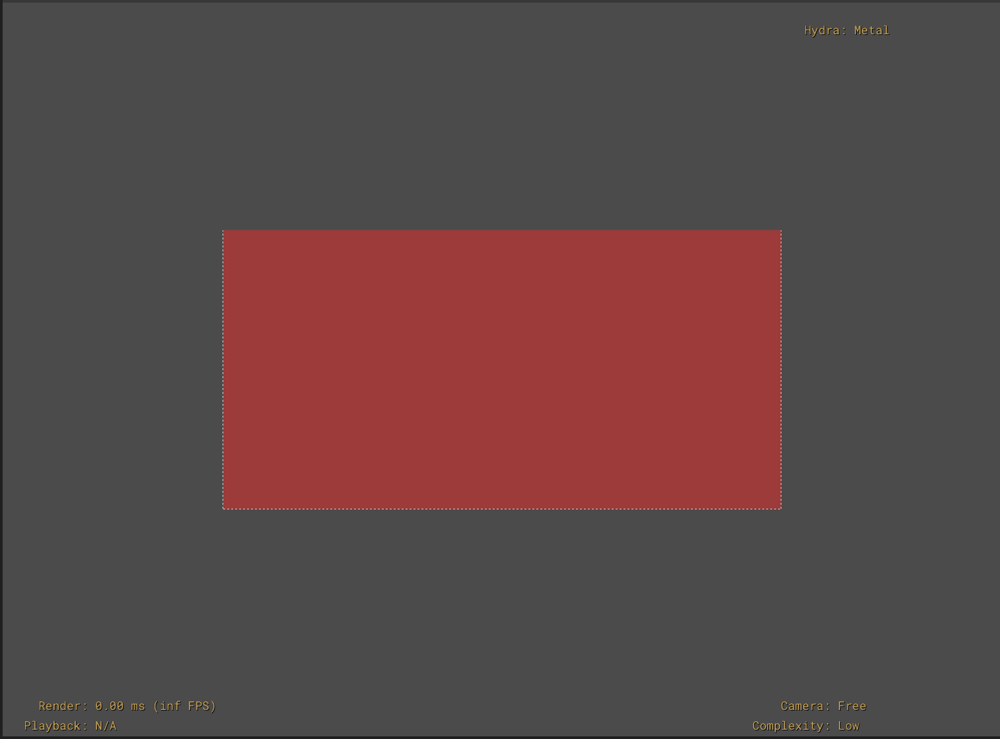
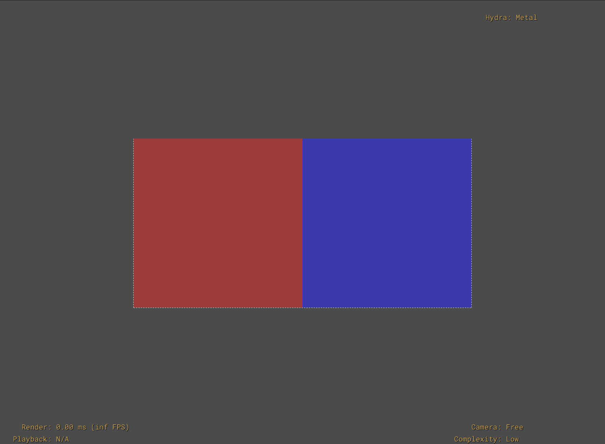
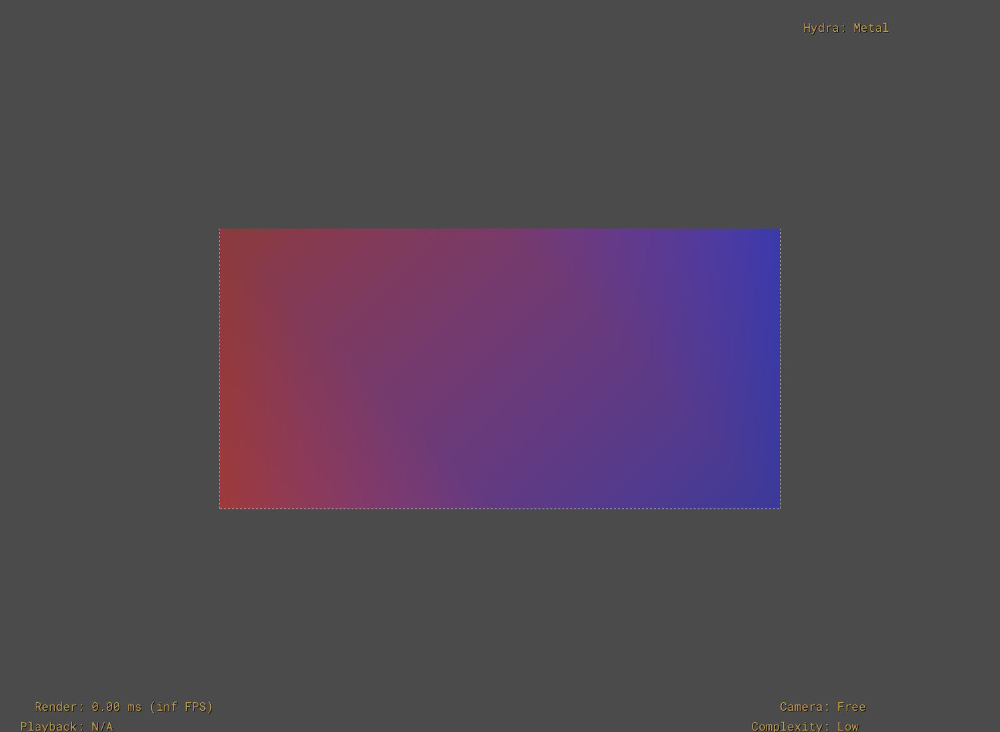
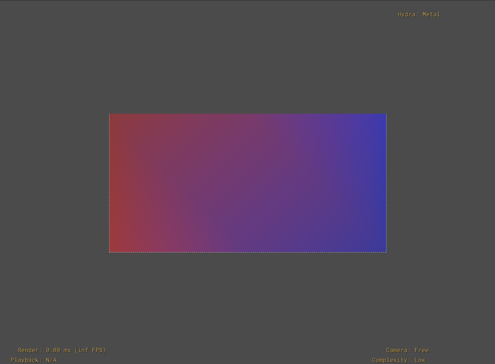
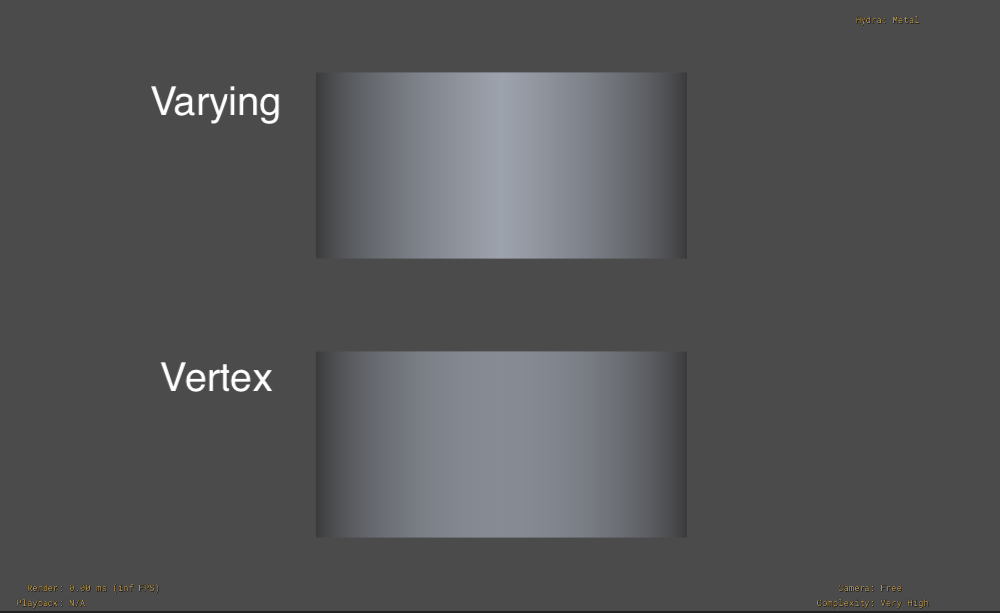
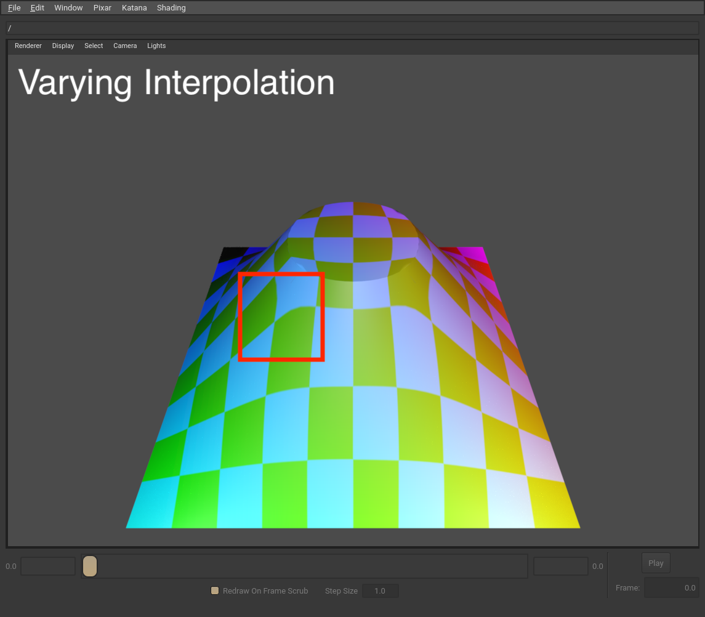
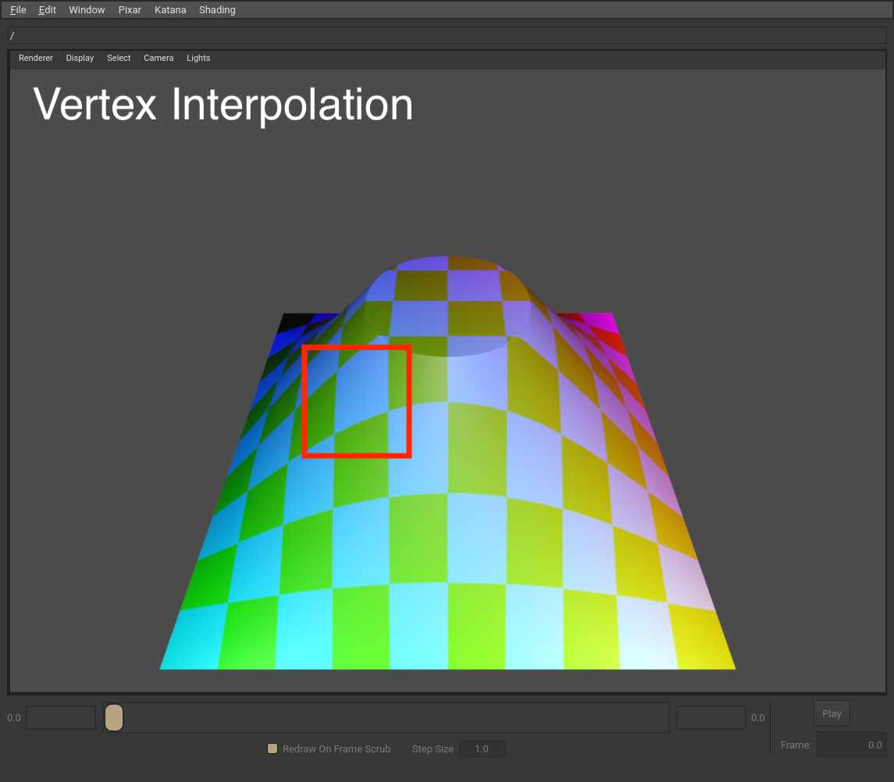
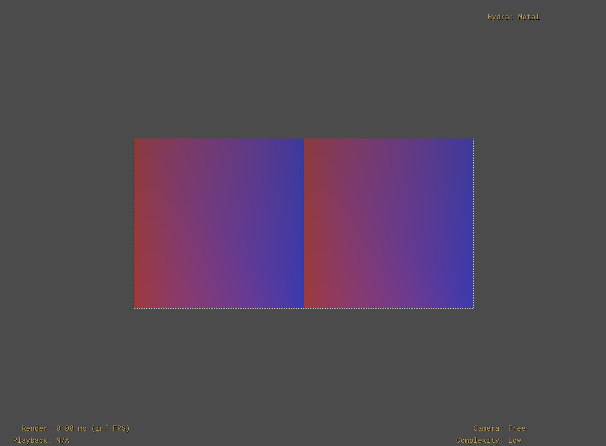
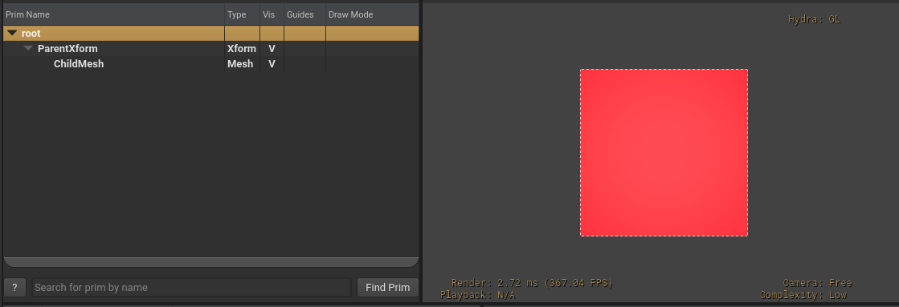

.. include:: ../rolesAndUtils.rst

.. _primvars:

########
Primvars
########

A primvar is a special type of attribute that can interpolate the value of the 
attribute over the surface/volume of a geometric prim. Primvars are most 
commonly used to communicate per-primitive overrides to shaders/materials for 
rendering (e.g. providing texture coordinates for a surface), but can be used 
wherever a surface or volume-varying signal is needed.

.. _primvar_interpolation_modes:

***************************
Primvar Interpolation Modes
***************************

USD currently supports five primvar interpolation modes:

* constant
* uniform
* varying
* vertex
* faceVarying

Each interpolation mode is described in more detail below. Example scenes are
provided that use a Mesh Gprim that consists of two quads, along with a primvar
for displayColor, to help visualize the interpolation modes via Hydra/Storm
(screenshots are from usdview).

.. note::

    Special thanks to the authors of the 
    `USD Working Group Primvar Interpolation article <https://github.com/usd-wg/assets/tree/main/docs/PrimvarInterpolation>`__
    for inspiration for these examples. 

.. _primvar_constant_interpolation:

Constant Interpolation
======================

A :ref:`single element <primvar_element_size>` is specified across the entire 
prim surface/volume. Note that you still need to provide an array (that contains 
a single element) for the primvar.

In our example we author the :mono:`displayColor` primvar using an array with a 
single color, and Hydra/Storm renders all the mesh faces with the single color.

.. code-block:: usda

    #usda 1.0
    (
    )

    def Mesh "constant"
    {
       float3[] extent = [(-1, 0, 0), (1, 1, 0)]
       point3f[] points = [(-1, 0, 0), (-1, 1, 0), (0, 1, 0), (0, 0, 0), (1, 1, 0), (1, 0, 0)]
       int[] faceVertexCounts = [4, 4]
       int[] faceVertexIndices = [3, 2, 1, 0, 5, 4, 2, 3]
      
       color3f[] primvars:displayColor = [(1, 0, 0)] (
           interpolation = "constant"
       )
      
       double3 xformOp:translate = (0, 0, -10)
       uniform token[] xformOpOrder = ["xformOp:translate"] 
    }

.. _primvar_uniform_interpolation:

Uniform Interpolation
=====================

:ref:`One element <primvar_element_size>` remains constant for each patch 
segment of the prim's surface/volume. For a mesh prim, provide an array with a 
single element for each face of the mesh. For a curve prim, provide an array 
with a single element for each curve segment (as described in 
:usdcpp:`UsdGeomBasisCurves -- Primvar Interpolation <UsdGeomBasisCurves>`). 

The elements in the array must match the count and order of the segments of the 
prim. For a Mesh prim, the primvar array must have the same number and order of 
elements as the Mesh's :mono:`faceVertexCounts` array. 

In our example mesh with two faces (quads), we author an array with two colors 
for the :mono:`displayColor` primvar, and the primvar specifies the appropriate 
color for each face. 

.. code-block:: usda

    #usda 1.0
    (
    )

    def Mesh "uniform"
    {
        float3[] extent = [(-1, 0, 0), (1, 1, 0)]
        point3f[] points = [(-1, 0, 0), (-1, 1, 0), (0, 1, 0), (0, 0, 0), (1, 1, 0), (1, 0, 0)]
        int[] faceVertexCounts = [4, 4]
        int[] faceVertexIndices = [3, 2, 1, 0, 5, 4, 2, 3]
        
        color3f[] primvars:displayColor = [(1, 0, 0), (0,0,1)] (
            interpolation = "uniform"
        )
        
        double3 xformOp:translate = (0, 0, -10)
        uniform token[] xformOpOrder = ["xformOp:translate"]  
    }

.. _primvar_vertex_interpolation:

Vertex Interpolation
====================

:ref:`Elements <primvar_element_size>` are interpolated by applying the surface 
or curve basis functions.

For Mesh prims, you'll provide a primvar array with one element for each 
point of the mesh, with the order of the primvar array matching the order 
of the Mesh :mono:`points` array.

.. note::

    Meshes are defined in terms of points that are connected into edges and 
    faces. Many references to meshes use the term 'vertex' in place of or 
    interchangeably with 'points', while some use 'vertex' to refer to the 
    'face-vertices' that define a face.  To avoid confusion, the term 'vertex' 
    is intentionally avoided in favor of 'point' or 'face vertex'.

For BasisCurves, you'll provide a primvar array with one element for each 
point of the curve, matching the order of the prim's :mono:`points` array.

In our example Mesh with two faces, we author an array with six colors 
(matching the Mesh :mono:`points` array count and order). Hydra/Storm renders 
the Mesh with vertex interpolation going from red at (-1,0,0) to blue at 
(1,1,0).

.. code-block:: usda

    #usda 1.0
    (
    )

    def Mesh "vertex"
    {
        float3[] extent = [(-1, 0, 0), (1, 1, 0)]
        point3f[] points = [(-1, 0, 0), (-1, 1, 0), (0, 1, 0), (0, 0, 0), (1, 1, 0), (1, 0, 0)]
        int[] faceVertexCounts = [4, 4]
        int[] faceVertexIndices = [3, 2, 1, 0, 5, 4, 2, 3]
        
        color3f[] primvars:displayColor = [(1, 0, 0), (0.75,0,0), (0.5,0,0.25), (0.25,0,0.5), (0,0,1), (0,0,0.75)] (
            interpolation = "vertex"
        )
        
        double3 xformOp:translate = (0, 0, -10)
        uniform token[] xformOpOrder = ["xformOp:translate"]  
    }

.. _primvar_varying_interpolation:

Varying Interpolation
=====================

:ref:`Elements <primvar_element_size>` are interpolated over each surface patch 
or curve segment using linear basis functions. Bilinear or barycentric 
interpolation is used to interpolate over quad surface patches or triangulated 
mesh faces respectively. Linear interpolation is used to interpolate over curve 
segments.

For Mesh prims, you'll provide a primvar array with one element for each 
point of the mesh, with the order of the primvar array matching the order 
of the Mesh :mono:`points` array. Using varying interpolation to set color 
elements for mesh points is similar to setting "vertex colors" in game engines.

For BasisCurves, you'll provide a primvar array with two elements for 
each curve segment. The number of segments will depend on the curve type, 
wrap (periodicity), and :mono:`curveVertexCounts` values of your curve, as 
described in the tables in 
:usdcpp:`UsdGeomBasisCurves -- Primvar Interpolation <UsdGeomBasisCurves>`.

In our example Mesh with two faces, we author an array with six colors 
(matching the Mesh :mono:`points` array count and order). Hydra/Storm renders 
the Mesh with varying interpolation going from red at (-1,0,0) to blue at (1,1,0).

.. code-block:: usda

    #usda 1.0
    (
    )

    def Mesh "varying"
    {
        float3[] extent = [(-1, 0, 0), (1, 1, 0)]
        point3f[] points = [(-1, 0, 0), (-1, 1, 0), (0, 1, 0), (0, 0, 0), (1, 1, 0), (1, 0, 0)]
        int[] faceVertexCounts = [4, 4]
        int[] faceVertexIndices = [3, 2, 1, 0, 5, 4, 2, 3]
        
        color3f[] primvars:displayColor = [(1, 0, 0), (0.75,0,0), (0.5,0,0.25), (0.25,0,0.5), (0,0,1), (0,0,0.75)] (
            interpolation = "varying"
        )
        
        double3 xformOp:translate = (0, 0, -10)
        uniform token[] xformOpOrder = ["xformOp:translate"]  
    }

Notice that the example output looks similar to the vertex interpolation Mesh
example. The difference between varying and vertex interpolation can be subtle. 
As vertex interpolation uses the basis function of the prim's surface or curve, 
we can visualize the difference if we adjust how our Mesh prim is subdivided. 
The following example shows the same two-quad Mesh prim using varying and vertex 
interpolation, with :mono:`displayColor` primvars going from black to white. 
Rendering this using usdview with ``--complexity veryhigh`` shows how the vertex 
interpolation across a highly subdivided surface follows a smoother gradient, 
whereas the varying interpolation results in a more linear gradient. 

.. code-block:: usda

    #usda 1.0
    (
    )

    def Mesh "varying"
    {
        float3[] extent = [(-1, 0, 0), (1, 1, 0)]
        point3f[] points = [(-1, 0, 0), (-1, 1, 0), (0, 1, 0), (0, 0, 0), (1, 1, 0), (1, 0, 0)]
        int[] faceVertexCounts = [4, 4]
        int[] faceVertexIndices = [3, 2, 1, 0, 5, 4, 2, 3]
        
        color3f[] primvars:displayColor = [(0, 0, 0), (0,0,0), (1,1,1), (1,1,1), (0,0,0), (0,0,0)] (
            interpolation = "varying"
        )

        double3 xformOp:translate = (0, 0, -10)
        uniform token[] xformOpOrder = ["xformOp:translate"]  
    }

    def Mesh "vertex"
    {
        float3[] extent = [(-1, 0, 0), (1, 1, 0)]
        point3f[] points = [(-1, 0, 0), (-1, 1, 0), (0, 1, 0), (0, 0, 0), (1, 1, 0), (1, 0, 0)]
        int[] faceVertexCounts = [4, 4]
        int[] faceVertexIndices = [3, 2, 1, 0, 5, 4, 2, 3]
        
        color3f[] primvars:displayColor = [(0, 0, 0), (0,0,0), (1,1,1), (1,1,1), (0,0,0), (0,0,0)] (
            interpolation = "vertex"
        )

        double3 xformOp:translate = (0, -1.5, -10)
        uniform token[] xformOpOrder = ["xformOp:translate"]  
    }

Here is another example showing the difference between varying and vertex
interpolation using a more complex surface and a texture. Notice how the 
texture appears slightly more "stretched" along the edge of a patch in the
highlighted area of the varying interpolation example.

.. note::

    If you're working with polygonal mesh data that is explicitly not intended 
    to be subdivided, you should use varying interpolation in addition to 
    setting the mesh subdivision scheme to :mono:`none`. This will ensure that 
    the mesh renders identically whether a renderer supports subdivision or not.

.. _primvar_facevarying_interpolation:

faceVarying Interpolation
=========================

For polygons and subdivision surfaces, faceVarying interpolation allows you to 
specify different :ref:`elements <primvar_element_size>` for each face-vertex.
Bilinear interpolation (with additional rules for subdivision surfaces, see 
below) is used for interpolation between the elements. faceVarying interpolation 
allows you to specify different elements for each face-vertex of each point on 
the Mesh, which allows you to achieve unique interpolation of primvar elements 
across each face without affecting interpolation of primvar elements on 
surrounding faces. For example, you can use faceVarying interpolation to create 
discontinuous vertex UVs to create a "seam" in your texture-coordinate mapping, 
if you wanted to emulate wrapping a label around a cylinder. As another example, 
faceVarying interpolation is often used with 
:ref:`indexed primvars <primvar_indexed>` to describe mesh topology 
discontinuities.

.. note::

    Currently, faceVarying interpolation is not support for basis curves.

For Mesh prims, you'll provide a primvar array with one element for each 
face-vertex of each face, with the order of the primvar array matching 
the order of the Mesh :mono:`faceVertexIndices` array.

In our example mesh with two faces, we author an array with eight colors 
(matching the Mesh :mono:`faceVertexIndices` array count and order). Hydra/Storm 
renders the Mesh with varying interpolation going from red to blue for each face.

.. code-block:: usda

    #usda 1.0
    (
    )

    def Mesh "faceVarying"
    {
        float3[] extent = [(-1, 0, 0), (1, 1, 0)]
        point3f[] points = [(-1, 0, 0), (-1, 1, 0), (0, 1, 0), (0, 0, 0), (1, 1, 0), (1, 0, 0)]
        int[] faceVertexCounts = [4, 4]
        int[] faceVertexIndices = [3, 2, 1, 0, 5, 4, 2, 3]
        
        color3f[] primvars:displayColor = [(0,0,1), (0,0,0.75), (0.75,0,0), (1,0,0), 
                                           (0,0,1), (0,0,0.75), (0.75,0,0), (1,0,0)] (
            interpolation = "faceVarying"
        )
        
        double3 xformOp:translate = (0, 0, -10)
        uniform token[] xformOpOrder = ["xformOp:translate"]  
    }

You can further control how elements are interpolated for subdivision surfaces 
through the :mono:`faceVaryingLinearInterpolation` Mesh attribute. See the 
:usdcpp:`Mesh API doc <UsdGeomMesh::GetFaceVaryingLinearInterpolationAttr>`
and `OpenSubdiv documentation on FaceVarying Primvars <https://opensubdiv.org/docs/subdivision_surfaces.html#face-varying-interpolation-rules>`__ 
for more details on the different rules. The previous example configured to
use linear interpolation for the boundaries and interior of each face would
look like the following.

.. code-block:: usda

    #usda 1.0
    (
    )

    def Mesh "faceVarying"
    {
        float3[] extent = [(-1, 0, 0), (1, 1, 0)]
        point3f[] points = [(-1, 0, 0), (-1, 1, 0), (0, 1, 0), (0, 0, 0), (1, 1, 0), (1, 0, 0)]
        int[] faceVertexCounts = [4, 4]
        int[] faceVertexIndices = [3, 2, 1, 0, 5, 4, 2, 3]
        
        color3f[] primvars:displayColor = [(0,0,1), (0,0,0.75), (0.75,0,0), (1,0,0), 
                                           (0,0,1), (0,0,0.75), (0.75,0,0), (1,0,0)] (
            interpolation = "faceVarying"
        )

        # Configure the face-varying interpolation rule for this surface 
        token faceVaryingLinearInterpolation = "all"
        
        double3 xformOp:translate = (0, 0, -10)
        uniform token[] xformOpOrder = ["xformOp:translate"]  
    }

.. _primvar_scene_namespace:

********************************
Primvars and the Scene Namespace
********************************

Primvars have a characteristic different from most USD attributes in that 
primvars will get "inherited" down the scene namespace. Regular USD attributes 
only apply to the prim on which they are specified, but primvars implicitly 
*also* apply to all child imageable prims (unless the child prims have their own 
opinions about those primvars). This allows for sparse authoring of sharable 
data in use-cases that require broadly authoring values for all Gprims in a 
complex model hierarchy. 

Note that only **constant** interpolation modes are applied down the namespace.
This restriction prevents unintentional and hard-to-diagnose asset breakage if
topology-dependent interpolation modes are propagated down the namespace and 
the Mesh topology changes. 

In the following example, ParentXform has an opinion for the 
:mono:`displayColor` primvar (using constant interpolation). ChildMesh has no 
opinion authored for the :mono:`displayColor` primvar, but will get rendered 
with the primvar value from its parent.

.. code-block:: usda

    #usda 1.0
    (
    )

    def Xform "ParentXform"
    {        
        color3f[] primvars:displayColor = [(1, 0, 0)] (
            interpolation = "constant"
        )
        
        double3 xformOp:translate = (0, 0, -10)
        uniform token[] xformOpOrder = ["xformOp:translate"]  

        def Mesh "ChildMesh"
        {
            float3[] extent = [(0, 0, 0), (1, 1, 0)]
            point3f[] points = [(0, 0, 0), (0, 1, 0), (1, 1, 0), (1, 0, 0)]
            int[] faceVertexCounts = [4]
            int[] faceVertexIndices = [3, 2, 1, 0]
            
            # Primvar inherits down namespace, so this child prim automatically gets primvar 
            
            double3 xformOp:translate = (0.5, -1, 0)
            uniform token[] xformOpOrder = ["xformOp:translate"]  
        }
    }

When using :ref:`scene instancing <usdglossary-instancing>`, primvars are 
implicitly applied down the hierarchy for instances, as expected. You can author 
overriding values for primvars on the instance prim and these edits will be 
implicitly applied for that instance. Note that you cannot override primvars on 
child prims of instance prims, as properties on descendant prims beneath 
instance prims is not allowed by scene instancing.

.. _primvar_indexed:

****************
Indexed Primvars
****************

Primvars support *indexed data*, so data can be referred to by index rather 
than repeating the full elements, thereby reducing memory usage. A common 
use-case is using a primvar to describe surface normals for a Mesh, where 
several vertices use the same normal vector. In this scenario, it would be 
much more efficient to use primvar indices rather than duplicating the normals 
in the primvar array. 

As an example, we can replicate the faceVarying interpolation example shown
earlier, but use indices to avoid having to repeat duplicate colors:

.. code-block:: usda

    #usda 1.0
    (
    )

    def Mesh "faceVarying"
    {
        float3[] extent = [(-1, 0, 0), (1, 1, 0)]
        point3f[] points = [(-1, 0, 0), (-1, 1, 0), (0, 1, 0), (0, 0, 0), (1, 1, 0), (1, 0, 0)]
        int[] faceVertexCounts = [4, 4]
        int[] faceVertexIndices = [3, 2, 1, 0, 5, 4, 2, 3]
        
        color3f[] primvars:displayColor = [(0,0,1), (0,0,0.75), (0.75,0,0), (1,0,0)] (
            interpolation = "faceVarying"
        )
        # Use primvar indices to avoid duplicate elements in primvars array
        int[] primvars:displayColor:indices = [0,1,2,3,0,1,2,3]
        
        double3 xformOp:translate = (0, 0, -10)
        uniform token[] xformOpOrder = ["xformOp:translate"]  
    }

Note that indices refer to *elements* in the primvar, which in this example
(and in most use-cases) equates to values in the primvar array. However, if
the *element size* of the primvar is greater than 1, an index refers to an 
element made up of more than 1 primvar array value. See 
:ref:`element size <primvar_element_size>` for an example.

Primvars using faceVarying interpolation can use indexing to unambiguously 
define discontinuities in their functions at edges and vertices, along with
using faceVarying linear interpolation rules, as described in `OpenSubdiv documentation on FaceVarying Primvars <https://opensubdiv.org/docs/subdivision_surfaces.html#face-varying-interpolation-rules>`__.

.. _primvar_indexed_and_blocks:

Indexed Primvars and Attribute Blocks
=====================================

While primvars are accessible as attributes, you should avoid directly using
:ref:`attribute blocks <usdglossary-attributeblock>` on a primvar. This is 
because an attribute block on a primvar will only block the primvar elements, 
but not the primvar indices (which, as we saw above, are encoded in a separate 
attribute so that they can vary over time, when desired). Instead, use the 
:mono:`BlockPrimvar()` API from UsdGeom.PrimvarsAPI which blocks primvar 
elements and indices. 

Using the faceVarying example with primvar indices from earlier, if we just
blocked the primvar as an attribute:

.. code-block:: python

    stage = Usd.Stage.Open("faceVarying-example.usda")

    prim = stage.GetPrimAtPath("/faceVarying")

    primvar_api = UsdGeom.PrimvarsAPI(prim)

    # If you call Block() on the primvar attribute, this will only block the
    # elements, not the indices

    primvar = primvar_api.GetPrimvar("primvars:displayColor")
    primvar.GetAttr().Block()

    print(stage.ExportToString())

The flattened stage will have :mono:`primvars:displayColor` set to
None, but :mono:`primvars:displayColor:indices` still set to our authored array 
of indices:

.. code-block:: usda

    def Mesh "faceVarying"
    {
        float3[] extent = [(-1, 0, 0), (1, 1, 0)]
        int[] faceVertexCounts = [4, 4]
        int[] faceVertexIndices = [3, 2, 1, 0, 5, 4, 2, 3]
        point3f[] points = [(-1, 0, 0), (-1, 1, 0), (0, 1, 0), (0, 0, 0), (1, 1, 0), (1, 0, 0)]
        color3f[] primvars:displayColor = None (
            interpolation = "faceVarying"
        )
        int[] primvars:displayColor:indices = [0, 1, 2, 3, 0, 1, 2, 3]
        double3 xformOp:translate = (0, 0, -10)
        uniform token[] xformOpOrder = ["xformOp:translate"]
    }

This could cause subtle problems if later the primvar elements are re-authored
without knowing how the indices are set. If instead we call 
:mono:`BlockPrimvar()`:

.. code-block:: python

    primvar_api.BlockPrimvar("primvars:displayColor")

The primvar elements and indices are both set to :mono:`None`.

.. code-block:: usda

    def Mesh "faceVarying"
    {
        float3[] extent = [(-1, 0, 0), (1, 1, 0)]
        int[] faceVertexCounts = [4, 4]
        int[] faceVertexIndices = [3, 2, 1, 0, 5, 4, 2, 3]
        point3f[] points = [(-1, 0, 0), (-1, 1, 0), (0, 1, 0), (0, 0, 0), (1, 1, 0), (1, 0, 0)]
        color3f[] primvars:displayColor = None (
            interpolation = "faceVarying"
        )
        int[] primvars:displayColor:indices = None
        double3 xformOp:translate = (0, 0, -10)
        uniform token[] xformOpOrder = ["xformOp:translate"]
    }

.. _primvar_element_size:

********************
Primvar Element Size
********************

In the examples in this doc we use the term "elements" to mean single values in 
a primvar's value array. However, primvars can optionally specify 
:mono:`elementSize`, which sets how many consecutive values in the primvar array 
should be treated as a single element to be interpolated over a Gprim. If not 
set, a primvar's elementSize defaults to 1.

As a simple example, we have a prim with a primvar that has a value array of
strings, and an elementSize of 2. The primvar is 
:ref:`indexed <primvar_indexed>`, so we can inspect the flattened primvar to 
show how each indexed element refers to a pair of strings from the strings 
array.

.. code-block:: usda

    #usda 1.0
    (
    )

    def Cube "TestPrim"
    {
        string[] primvars:testPrimvar = ["element1-partA", "element1-partB", "element2-partA", "element2-partB"] (
            elementSize = 2
        )
        int[] primvars:testPrimvar:indices = [0, 1, 0]
    }

The flattened primvar will look like:

.. code-block:: 

    [element1-partA, element1-partB, element2-partA, element2-partB, element1-partA, element1-partB]

Notice how the primvar indices refer to pairs of values in the value array -- 
the "1" index refers to the third *and* fourth items in the values array.

Generally, the default element size of 1 will work for most use-cases. However
you may encounter use-cases where you need to communicate an aggregate element
to a renderer (e.g. representing spherical harmonics using nine floating-point
coefficients) using larger element sizes.